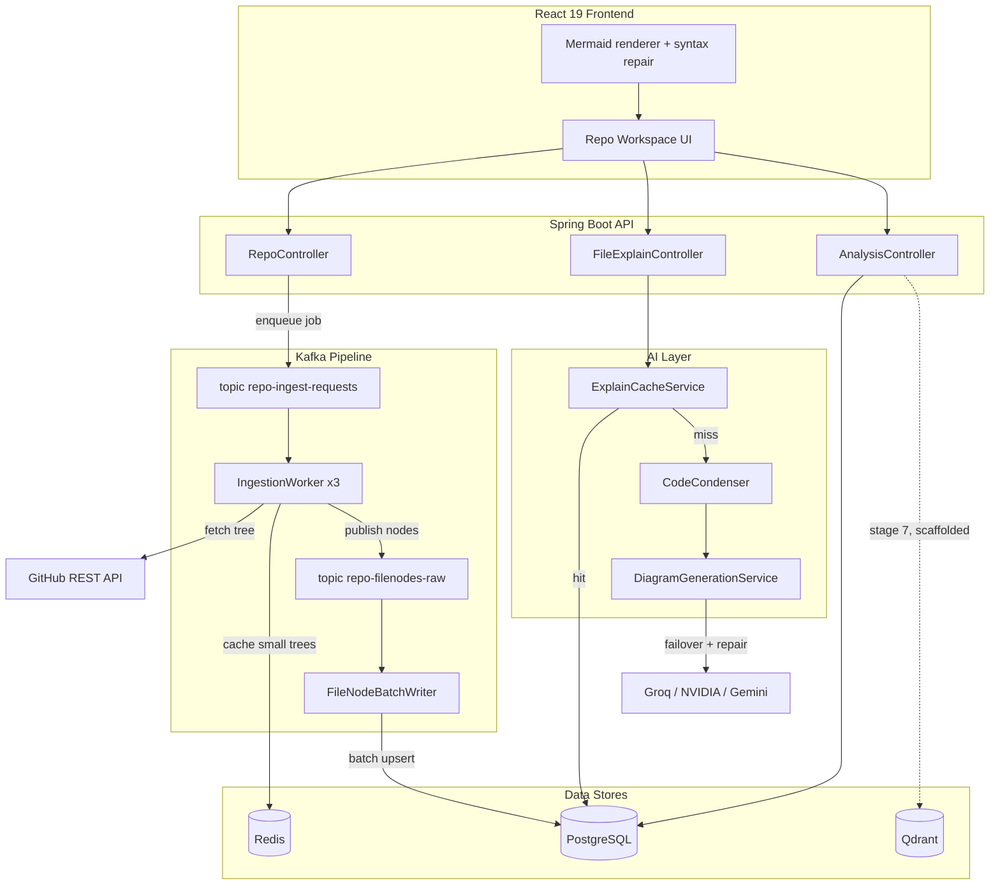

# RepoMind — Project Brief

> **Purpose of this document.** Everything needed to put RepoMind on a resume, defend it in an
> interview, and demonstrate the engineering judgment behind it. Section 2 is copy-paste ready
> for the resume itself; Sections 4–7 are the interview ammunition.

**One line:** An AI repository-intelligence platform that ingests any GitHub repo through a
Kafka pipeline and turns individual source files — and the repository as a whole — into
accurate, rendered architecture diagrams.

**Stack:** Java 21 · Spring Boot 4 · PostgreSQL · Kafka · Redis · Qdrant · React 19 · Docker Compose
**Scale of the codebase:** 72 backend classes, 13 Flyway migrations, 10-container local stack, 115 automated tests (74 backend / 41 frontend), all green.

---

## 1. The problem it solves

Reading an unfamiliar codebase is the single most expensive part of onboarding, code review, and
bug triage. The questions are always the same — where does execution start, which modules own
what, how does a request reach the database, what breaks if I change this — and answering them
means opening dozens of files by hand.

RepoMind compresses that loop. Point it at a GitHub URL and it produces a navigable system map:
a whole-repository architecture diagram, plus a per-file diagram (sequence, flowchart, or class
diagram, chosen by the file's role) generated from the file's real structure.

The design constraint that shaped almost every decision: **LLM calls are slow, rate-limited,
non-deterministic, and cost money.** Most of the engineering below is about making an unreliable,
expensive dependency behave like a reliable, cheap one.

---

## 2. Resume-ready bullets

Pick the block that fits your space. Every claim is verifiable from the repository.

### 2a. Short — 3 bullets (for a dense one-page resume)

> **RepoMind — AI Repository Intelligence Platform** · *Java 21, Spring Boot 4, Kafka, PostgreSQL, Redis, React 19, Docker*
>
> - Built a full-stack platform that ingests GitHub repositories through a **Kafka-based
>   asynchronous pipeline** and generates AI architecture diagrams per file and per repository;
>   10-container Docker Compose stack with **13 Flyway migrations** and **115 automated tests**.
> - Engineered a **multi-provider LLM failover chain** (Groq → NVIDIA → Gemini) with an
>   output-repair retry and per-file model tiering, plus a **content-hash diagram cache** that
>   deduplicates generation across all users so each file version is paid for exactly once.
> - Hardened the ingestion path for **concurrency and idempotency** — canonical-repo
>   deduplication under a race, `ON CONFLICT DO NOTHING` batch writes, deferred Kafka acks, and
>   rate-limit backoff bounded below `max.poll.interval` to prevent consumer rebalance loops.

### 2b. Detailed — 5 bullets (for a projects-focused or fresher resume)

> **RepoMind — AI Repository Intelligence Platform** · [github.com/savaliyabhargav/RepoMind](https://github.com/savaliyabhargav/RepoMind)
> *Java 21 · Spring Boot 4 · PostgreSQL · Apache Kafka · Redis · Qdrant · React 19 · Docker Compose*
>
> - Designed and built a full-stack platform that converts any GitHub repository into rendered
>   architecture diagrams — per-file (sequence / flowchart / class, selected by file role) and a
>   whole-repository system map — backed by a 10-service containerized stack.
> - Decoupled repository ingestion from the HTTP request lifecycle using **Apache Kafka**: an API
>   call enqueues a job, three concurrent consumers fetch the GitHub tree, and a **scheduled batch
>   writer** flushes file nodes to PostgreSQL in 1,000-row `JdbcTemplate` batches every 2s,
>   acknowledging Kafka **only after** the database write is confirmed.
> - Built a resilient AI layer over three free-tier providers: an ordered **failover chain**, a
>   cheap **repair call** that re-parses malformed model output before failing over (rescuing
>   near-miss responses at a fraction of prompt cost), **complexity-based model tiering**, and
>   strict schema validation of every response before it reaches the UI.
> - Cut redundant LLM spend to near zero with a **SHA-256 content-hash cache** keyed on
>   `(canonical repo, path, content hash)` — a given file version is generated once across all
>   users and sessions, with cache writes isolated in `REQUIRES_NEW` transactions and a
>   race-tolerant upsert.
> - Solved production-shaped **distributed-systems failure modes**: duplicate-fetch races between
>   workers (wait-then-takeover on a `FETCHING` canonical row), non-idempotent inserts on Kafka
>   redelivery, unbounded rate-limit sleeps triggering consumer eviction, and silent batch loss on
>   transient DB failure (re-queue instead of drop).

### 2c. Skills-section one-liner

> **RepoMind** — AI repo-intelligence platform (Spring Boot 4, Kafka, PostgreSQL, Redis, React 19,
> Docker): async ingestion pipeline, multi-provider LLM failover with content-hash caching,
> idempotent concurrent consumers.

### 2d. Suggested resume "Skills" keywords this project earns you

`Java 21` `Spring Boot 4` `Spring Security` `Spring Data JPA` `Apache Kafka` `PostgreSQL`
`Redis` `Flyway` `WebClient / WebFlux` `Docker Compose` `React 19` `Vite` `Zustand`
`REST API design` `Event-driven architecture` `Distributed systems` `Idempotency`
`Caching strategy` `LLM integration` `JUnit 5` `Mockito` `Vitest`

---

## 3. Architecture



**Ingestion flow.** `POST /repo/ingest` validates the URL, persists a `PENDING` repo row, and
publishes to Kafka — the HTTP request returns `202` immediately. Three `IngestionWorker` consumers
resolve a **canonical repo** row (deduplicating the same GitHub repo across different users),
fetch metadata and the recursive tree from GitHub, cache small trees in Redis for instant first
paint, and publish each file node to a second topic. `FileNodeBatchWriter` buffers those nodes and
flushes them to PostgreSQL on a 2-second schedule.

**Explain flow.** A file request checks the durable diagram cache by content hash. On a miss, the
source is condensed, the file's real imports are resolved against the repo's own files to name
true collaborators in the prompt, and `DiagramGenerationService` runs the failover chain. The
result is validated, cached, and returned. The frontend repairs and renders the Mermaid output.

---

## 4. Engineering decisions worth talking about

This is the section that separates the project from a tutorial. Each item is a real problem that
was hit, a decision made, and the reasoning behind it.

### 4.1 Ingestion is idempotent because Kafka guarantees at-least-once, not exactly-once

Kafka redelivers on consumer failure, and three concurrent workers can race on the same
repository. The first version violated the `(canonical_repo_id, path)` unique constraint and
failed the *entire* batch.

**Decision:** switch the batch write to `INSERT ... ON CONFLICT (canonical_repo_id, path) DO NOTHING`
via `JdbcTemplate.batchUpdate`, making every write safely repeatable. This is what makes the
"take over a crashed worker's fetch" recovery path (§4.2) safe — a double publish costs nothing.

### 4.2 Two workers, one repository: wait-then-takeover

Two users submitting the same repo simultaneously would both fetch the full tree from GitHub —
doubling API spend against a hard rate limit.

**Decision:** a `canonical_repos` row with a unique `(owner, repo_name, provider)` constraint acts
as the arbiter. The loser of the insert race doesn't fetch; it polls the canonical row for up to
60s waiting for `READY`. If the row is *still* `FETCHING` after the timeout, the original worker
is presumed dead and the waiter takes over the fetch — safe precisely because writes are
idempotent. Already-`READY` canonicals skip GitHub entirely, so the second user's repo links
instantly at zero API cost.

### 4.3 Rate-limit sleeps are bounded by Kafka's consumer contract

Sleeping until GitHub's rate-limit window resets is the obvious fix — and it silently breaks
Kafka. A consumer that doesn't poll within `max.poll.interval.ms` is evicted from the group,
triggering a rebalance and redelivery, which sleeps again: an infinite loop.

**Decision:** cap the wait at 180s (with `max.poll.interval` raised to 10 minutes for headroom).
Beyond the cap, fail fast with an *actionable* message telling the operator to set `GITHUB_TOKEN`
to lift the limit from 60 to 5,000 requests/hour. Rate-limit waits deliberately don't consume the
transient-retry budget — the wait is bounded by GitHub's own reset timestamp, not by guesswork.

### 4.4 Kafka acks are deferred until the database confirms

`FileNodeBatchWriter` buffers messages in a `ConcurrentLinkedQueue` and acknowledges **after**
`batchUpdate` returns successfully. If the flush throws, the nodes are pushed back onto the queue
for the next cycle rather than dropped.

**Why it matters:** acking on receipt would silently lose up to 1,000 file nodes on any transient
database hiccup, and the repository would render with a partial tree and no error anywhere.

### 4.5 Caching diagrams by content hash, not by file ID

An LLM diagram for a specific *version* of a file is stable at low temperature. Keying the cache
on file identity would invalidate on every unrelated repo change; keying on the file's SHA-256
content hash means the entry stays valid until the file itself changes, and because the key is
scoped to the **canonical** repo rather than the user's repo row, *every* user of that repository
shares the same cached diagram.

Cache writes run in `Propagation.REQUIRES_NEW` because the calling service holds a read-only
transaction, and a `DataIntegrityViolationException` from a concurrent write is caught and
ignored — the racing request cached the identical key, so nothing is lost.

### 4.6 Failing loudly beats failing plausibly

When every provider fails, the natural instinct is to return a generic placeholder diagram. That
is the wrong call here: the frontend caches successful responses per file, so a plausible-looking
fake would **stick in the cache after the provider recovered**, permanently misrepresenting the
code. The service throws instead, and the UI shows an actionable error with a retry.

### 4.7 A repair call is cheaper than a retry

Models frequently return *nearly* valid output — a stray markdown fence, a real newline inside a
JSON string, Java-style string concatenation. Re-running the full prompt to fix formatting means
paying for the entire source file again.

**Decision:** on a parse failure, send only the broken text back with a terse repair prompt at
temperature 0. It costs a fraction of the original call and rescues most near-misses before the
failover chain escalates to the next provider.

### 4.8 Condensing beats truncating

The original implementation cut source files at a fixed character count, routinely chopping a
class in half mid-method and asking the model to diagram the fragment.

**Decision:** `CodeCondenser` does a structured reduction — strip comments, imports, and blank
lines; if still over budget, *skeletonize* by keeping declarations, top-level method statements,
and control-flow lines while eliding deeply nested bodies with a `...` marker. The prompt then
explicitly tells the model that bodies were elided so it diagrams only what it can see instead of
inventing hidden logic. Structure per token goes up; hallucination goes down.

### 4.9 Grounding the prompt in the repository's real files

The model is given a **Related files** block built by extracting this file's imports (Java, JS/TS,
and Python patterns) and resolving them against the repository's own indexed file nodes, annotated
with each collaborator's role. The model names real components instead of inventing
`ServiceA → ServiceB`.

### 4.10 Model tiering by file complexity

DTOs, entities, and config files are routed to a small cheap model; anything with real control
flow gets the strong one. The explicit reasoning, recorded in the code: *a failed call on a
too-weak model costs more than the price difference* — so the default when uncertain is the
stronger model.

### 4.11 Rendering: fix the output client-side rather than paying the model to be careful

Mermaid is strict, and models reliably violate it in the same handful of ways. Rather than
spending prompt and output tokens on styling instructions, the frontend's `fixMermaidCode`
normalizes known failure patterns and **appends the `classDef` style palette itself** when the
model used `:::entry` / `:::db` / `:::external` tags. The model spends its budget on structure;
presentation is deterministic and free.

### 4.12 Redis caching with a size threshold

Small repository trees are cached in Redis for instant first paint. Repos above 5,000 nodes skip
it deliberately: serializing 50MB+ of JSON on the worker thread is *slower* than letting the
frontend wait one 2-second flush cycle and read from PostgreSQL. The cache is invalidated by the
batch writer once the nodes are durable.

### 4.13 Schema ownership belongs to migrations

13 Flyway migrations own the PostgreSQL schema; Hibernate validates against it rather than
generating it. Deterministic, reviewable, and rollback-friendly — the standard expected on any
team with more than one developer.

---

## 5. Known gaps and roadmap

Stating these plainly is deliberate. An interviewer who opens the repository will find them, and
knowing exactly where your own project is incomplete reads as engineering maturity. Do **not**
claim the first two as delivered features.

| Area | Current state | Next step |
|---|---|---|
| **Vector search / RAG** | `RetrievalService` is a stub returning `DISABLED` with zero counts. The Qdrant container, the embedding DTOs, pipeline stage 7, and the deep-pass consumer are all wired to it — the implementation is the missing piece. | Implement chunking + embedding upsert and repo-scoped similarity search. The call sites already exist and degrade gracefully. |
| **Endpoint authorization** | `SecurityConfig` is `.anyRequest().permitAll()`. RSA-signed JWTs, hashed + rotated refresh tokens, and the `JwtAuthFilter` are all implemented and tested — but nothing is currently enforced. | Replace with `.authenticated()` on `/repo/**` and `/analyses/**`, and derive `userId` from the authenticated principal instead of the request body. |
| **Analysis pipeline** | Runs synchronously inside the HTTP request, despite Kafka being available. Most stages are heuristic (path- and extension-based) with LLM enrichment behind feature flags. | Move to a Kafka topic like ingestion; surface stage progress over SSE. |
| **Chat / share links** | Tables exist (`V8`, `V9`, `V11`); no endpoints. | Build on top of retrieval once implemented. |
| **README** | Describes the intended end state, including SSE streaming and RAG chat, as though shipped. Also contains stray placeholder text. | Align with actual state — this brief is the accurate version. |
| **Committed secrets** | The root `.env` with API keys is tracked intentionally so judges can run `docker compose up --build` with zero setup. | Fine for a hackathon; rotate keys and untrack before making the repo public or showing it to an employer. **Do this before sharing the link on a resume.** |

---

## 6. Interview preparation

### Likely questions, with grounded answers

**"Why Kafka instead of just an async method or a thread pool?"**
Ingesting a large repository means a recursive GitHub API call, rate-limit waits of up to three
minutes, and tens of thousands of database rows. Holding an HTTP connection open for that is
unacceptable, and an in-process `@Async` task dies with the JVM — a deploy mid-ingestion silently
loses the work. Kafka gives durability (the job survives a restart), horizontal consumer scaling,
and at-least-once redelivery. The cost is that at-least-once forces you to make every write
idempotent, which is exactly why the batch writer uses `ON CONFLICT DO NOTHING`.

**"Walk me through a race condition you handled."**
Two users submit the same repository at the same moment. Both workers check for a canonical row,
both find nothing, both try to insert. The unique constraint on `(owner, repo_name, provider)`
lets exactly one win. The loser doesn't fetch — it polls the canonical row for up to 60 seconds
waiting for `READY`. If it's still `FETCHING` after that, the winner is presumed crashed, and the
loser takes over the fetch. That takeover is only safe because file-node writes are idempotent; a
double publish is a no-op.

**"How do you handle a non-deterministic dependency like an LLM?"**
Four layers. Validate everything — the response must parse as JSON and start with a recognized
Mermaid header, or it's rejected. Repair before retrying — send just the broken text back at
temperature 0, far cheaper than re-sending the source. Fail over across three providers in a
fixed order. And when everything fails, throw rather than fabricate, because the frontend caches
successes and a plausible fake would outlive the outage.

**"What would you do differently?"**
Three things. The analysis pipeline should run on Kafka like ingestion does — it's synchronous
inside the request purely because it was built earlier. `SecurityConfig` was opened up for local
testing and never closed; `userId` should come from the JWT principal, not the request body.
And the diagram cache is currently unbounded — it needs an eviction policy keyed on canonical-repo
deletion.

**"What was the hardest bug?"**
Ingestion intermittently hanging and redelivering forever. The cause was a rate-limit sleep that
could exceed Kafka's `max.poll.interval.ms`: the broker evicted the consumer as dead, rebalanced,
redelivered the message to another consumer, which hit the same rate limit and slept again. The
symptom looked like a GitHub problem; the cause was a Kafka consumer-liveness contract. The fix
was to cap the sleep below the poll interval and fail with an actionable message beyond it —
which also surfaced the real issue, an unset `GITHUB_TOKEN` capping the account at 60 requests/hour.

### Numbers you can state as fact

- 72 backend Java classes; 13 Flyway migrations; 10-service Docker Compose stack.
- 115 automated tests passing — 74 backend (JUnit 5 + Mockito + MockMvc, 1 disabled
  context-load test) and 41 frontend (Vitest + Testing Library).
- 3-provider LLM failover chain; 2-tier model routing; 3 concurrent Kafka consumers per topic.
- Batch writer: 1,000 rows per flush, 2-second interval, DB-confirmed acks.
- Ingestion retry policy: 3 attempts, 30s/60s backoff, 180s rate-limit ceiling.

### Numbers worth measuring before you claim them

Percentage claims are the fastest way to lose credibility if an interviewer probes. If you want
them, measure them first — the cache makes this easy, since you can time the same file with
`refresh=true` and `refresh=false`:

- Cache hit vs. miss latency for a file diagram (likely a large, quotable multiple).
- Ingestion wall-clock time for a repository of a stated file count.
- LLM call reduction across a repeat analysis of the same repository.

---

## 7. How to run it

```bash
git clone https://github.com/savaliyabhargav/RepoMind
cd RepoMind
docker compose up --build      # brings up all 10 services
```

Frontend at `http://localhost:5173`, API at `http://localhost:8080`.
Operational UIs: pgAdmin `:5050`, Kafka UI `:8090`, MinIO console `:9001`.

**Tests**

```bash
cd backend && ./mvnw test      # 74 tests, no infrastructure required
cd frontend && npx vitest run  # 41 tests
```

**Note:** set `GITHUB_TOKEN` in `.env` before demoing. Unauthenticated GitHub API access is capped
at 60 requests/hour and is the most likely cause of a failed live demo.

---

## 8. Selected API surface

| Method | Endpoint | Purpose |
|---|---|---|
| `POST` | `/repo/ingest` | Enqueue repository ingestion; returns `202` with `repoId` |
| `GET` | `/repo/{repoId}/tree` | File tree — Redis, then PostgreSQL, with an explicit `pending` state |
| `GET` | `/repo/{repoId}/overview` | Whole-repository system-design diagram |
| `GET` | `/repo/{repoId}/files/{fileId}/explain` | Per-file diagram; `?refresh=true` bypasses cache |
| `POST` | `/analyses` | Run the 7-stage analysis pipeline |
| `GET` | `/analyses/{id}/stages` | Per-stage results and token accounting |
| `POST` | `/auth/github` · `/auth/refresh` · `/auth/logout` | GitHub OAuth, token rotation, revocation |

---

## 9. Before you send this to anyone

- [ ] Rotate the API keys in `.env` and untrack the file (see §5).
- [ ] Clean the placeholder text out of `README.md` (top and bottom lines).
- [ ] Commit the in-flight explain/diagram work — it's currently uncommitted in the working tree
      and is the strongest part of the project.
- [ ] Close `SecurityConfig` before anyone opens `SecurityConfig.java:42`, or be ready to
      volunteer it as a known gap.
- [ ] Add a screenshot or short GIF of a rendered diagram to the README — this project is visual,
      and a reviewer spends far less time on it than you'd like.
